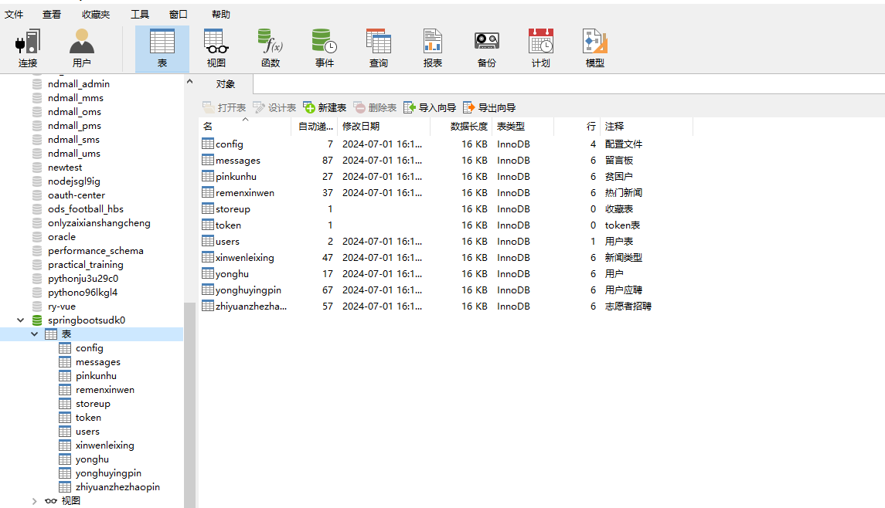

# 基于springboot的精准扶贫管理系统

#### 介绍

基于SpringBoot的精准扶贫管理系统旨在为精准扶贫工作提供一个高效、全面的管理平台。该系统通过信息化手段，系统化管理贫困户信息、新闻资讯、志愿者招聘等多方面内容，以提高扶贫工作的效率和效果。系统分为管理员和用户两个角色，各自拥有不同的功能模块，确保系统的安全性和使用的便捷性。

#### 技术栈

后端技术栈：Springboot+Mysql+Maven

前端技术栈：Vue+Html+Css+Javascript+ElementUI

开发工具：Idea+Vscode+Navicate

#### 系统功能介绍

管理员角色功能模块：  
个人中心：管理员可以管理个人信息，修改密码等，确保账户安全。  
用户管理：管理注册用户的信息，包括新增、编辑、删除用户，以及用户权限的分配。  
贫困户管理：录入、编辑和删除贫困户信息，跟踪和记录贫困户的帮扶情况。  
热门新闻管理：发布和管理与扶贫相关的新闻资讯，确保信息的及时性和准确性。  
新闻类型管理：管理新闻的分类，方便用户按类别查找相关资讯。  
志愿者招聘管理：发布和管理志愿者招聘信息，吸引更多人参与扶贫工作。  
用户应聘管理：管理志愿者的应聘信息，筛选和分配志愿者到合适的岗位。  
留言板管理：管理用户的留言和反馈，及时回复和解决用户的问题。  
系统管理：进行系统的整体管理和维护，包括系统设置、数据备份和恢复等功能。  

用户角色功能模块：  
首页：展示系统的主要功能和最新资讯，包括热门新闻、志愿者招聘信息等。  
贫困户：用户可以查看贫困户的详细信息，了解帮扶情况和需求。  
热门新闻：用户可以浏览最新的扶贫相关新闻和资讯，了解最新动态。  
志愿者招聘：查看和应聘志愿者岗位，参与到扶贫工作中。  
留言反馈：用户可以在留言板上提出问题和建议，系统管理员会及时回复。  
个人中心：用户可以管理个人信息，修改密码等，确保账户安全。  
后台管理：  
贫困户管理：查看和管理自己所帮扶的贫困户信息，记录帮扶进展。  
用户应聘管理：查看和管理自己的志愿者应聘信息。  
我的收藏管理：管理用户收藏的新闻资讯、贫困户信息等。  

#### 系统作用

提高扶贫效率：通过信息化手段，系统化管理贫困户和志愿者信息，确保扶贫工作有序进行。  
加强信息透明度：实时更新贫困户信息和扶贫动态，确保所有相关人员都能及时获取最新信息。  
促进志愿者参与：发布和管理志愿者招聘信息，吸引更多社会力量参与到扶贫工作中来。  
增强互动交流：通过留言板功能，收集用户反馈和建议，及时解决用户问题，改进系统功能。  
优化管理流程：系统化的管理功能，简化了管理员的工作流程，提高了工作效率。  

#### 系统功能截图

代码结构

数据库表

登录

用户端后台管理

贫困户管理

管理员端用户管理

热门新闻管理

用户应聘管理

系统管理

前台页面首页

热门新闻

留言反馈

个人中心

#### 总结

基于SpringBoot的精准扶贫管理系统，通过精细化、系统化的功能设计，为扶贫工作提供了强有力的技术支持。系统不仅提高了扶贫工作的效率和透明度，也加强了社会力量的参与度和互动交流。管理员和用户各自拥有完善的功能模块，确保系统的安全性和使用的便捷性。该系统的开发和应用，将为精准扶贫工作的推进提供重要保障，助力实现全面脱贫目标。

#### 使用说明

创建数据库，执行数据库脚本 修改jdbc数据库连接参数 下载安装maven依赖jar 启动idea中的springboot项目

后台地址：http://localhost:8080/springbootsudk0/admin/dist/index.html

管理员  abo 密码 abo

前台地址：http://localhost:8080/springbootsudk0/front/index.html

